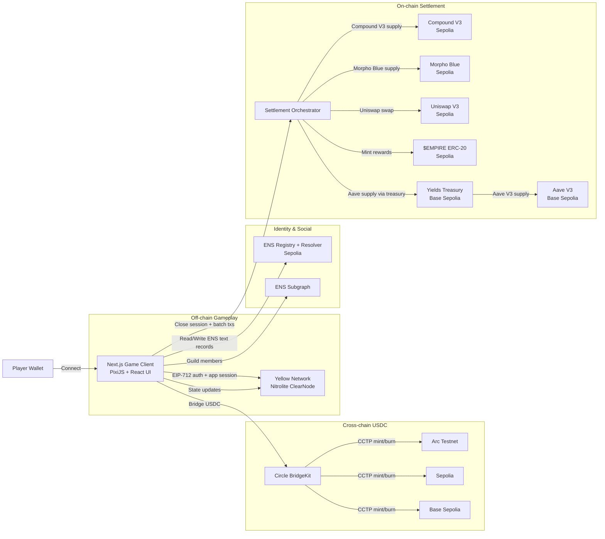

# Yield Empire (HackMoney 2026)

Yield Empire is a cooperative DeFi idle tycoon where every in‑game action maps to real DeFi operations. Players allocate USDC to protocol-themed buildings, earn **$EMPIRE tokens** based on real protocol APY rates, upgrade their empire, and contribute to guilds, all with **gasless gameplay** via Yellow Network state channels. When a player chooses to settle, the game batches outcomes into real on‑chain transactions across Sepolia and Base Sepolia, mints earned $EMPIRE tokens as ERC-20, while Circle BridgeKit powers cross‑chain USDC deposits and ENS provides identity and guild reputations.

## Category
Web3 Gaming / DeFi

## Hackathon Submission Answers

### Description
Yield Empire is a browser-based DeFi strategy game where players build a floating city and allocate USDC to real protocols represented as buildings. Gameplay happens off‑chain in Yellow Network state channels, so upgrades, deposits, compounding, and guild contributions feel instant and free. Players earn $EMPIRE tokens (ERC-20 on Sepolia) based on real protocol APY rates — the more USDC deposited and the higher the building level, the faster tokens accrue. Upgrades cost $EMPIRE tokens, not dollars. When a player settles, the app executes real transactions on testnets: Compound and Morpho supplies, Uniswap swaps on Sepolia, Aave supply on Base Sepolia via a treasury contract, and mints earned $EMPIRE tokens. ENS names and text records power player identity, guild profiles, and leaderboards, while Circle BridgeKit enables cross‑chain USDC deposits from Arc Testnet, Base Sepolia, or Sepolia. The result is a playable demo that turns multi‑chain DeFi into a fast, social, game-like experience.

### How it's made
The frontend is a Next.js 16 app in `yield-empire/` with a PixiJS isometric map and a React overlay UI. Wallet connection is handled by wagmi and RainbowKit. Yellow Network integration uses the `@erc7824/nitrolite` SDK to establish a WebSocket session, complete a 3‑step EIP‑712 auth flow, create an app session on NitroRPC/0.4, and submit gasless state updates for every action. Circle BridgeKit (`@circle-fin/bridge-kit`) powers CCTP transfers with a step‑by‑step progress UI and a viem adapter created from the user's wallet. ENS integration reads names, avatars, and text records, and creates guild subdomains using the ENS registry and public resolver. The $EMPIRE token (`contracts/src/EmpireToken.sol`) is an ERC-20 with a minter role pattern and daily mint cap, deployed on Sepolia. Players earn $EMPIRE based on real protocol APY rates fetched on-chain, with level multipliers boosting the earning rate. On settlement, protocol adapters execute real testnet transactions: Compound V3 supply, Morpho Blue supply, Uniswap V3 swap, Aave V3 supply on Base Sepolia via a treasury contract, and $EMPIRE token mint. Both contracts live in `contracts/` (Hardhat + OpenZeppelin). This "off‑chain game, on‑chain truth" architecture keeps the UX fast while still proving real DeFi execution.

## Key Features
- Gasless gameplay via Yellow Network state channels
- Cross‑chain USDC deposits via Circle BridgeKit (CCTP)
- Real DeFi settlement to Compound, Morpho, Uniswap, and Aave testnets
- $EMPIRE ERC-20 token — earn by depositing, spend on upgrades, minted on settlement
- ENS identity for players and guilds, plus subdomain-based membership
- Live protocol APY rates fetched on-chain (Compound, Aave, Morpho)
- PixiJS isometric world with upgradeable protocol buildings

## Partner Integrations
- Yellow Network (Nitrolite SDK) for state channels and app sessions
- Circle BridgeKit for cross‑chain USDC deposits and progress tracking
- ENS for identity, guilds, subdomains, and leaderboards
- Aave V3, Compound V3, Uniswap V3, Morpho Blue for real on‑chain execution

## Architecture Overview
- **Gameplay layer:** Yellow Network app session handles all actions off‑chain.
- **Settlement layer:** Batched on‑chain transactions on Sepolia and Base Sepolia.
- **Identity layer:** ENS names and text records store player and guild stats.
- **Bridge layer:** Circle BridgeKit transfers USDC across testnets.

## Architecture Diagram


## Project Structure
- `yield-empire/` Next.js app (frontend + game logic)
- `contracts/` Hardhat project (Treasury on Base Sepolia + EmpireToken on Sepolia)
- `docs/` design and integration notes
- `resources/` partner reference repos and docs

## Local Development

### Frontend
1. `cd yield-empire`
2. `npm install`
3. `npm run dev`

### Contracts (optional)
1. `cd contracts`
2. `npm install`
3. `npm run compile`

## Environment Variables
Create a `.env` file inside `yield-empire/` with:
```
NEXT_PUBLIC_WALLETCONNECT_PROJECT_ID=your_project_id
NEXT_PUBLIC_ARC_TESTNET_RPC_KEY=optional_arc_rpc_key
NEXT_PUBLIC_TREASURY_ADDRESS=0xYourTreasuryAddress
NEXT_PUBLIC_EMPIRE_TOKEN_ADDRESS=0xYourEmpireTokenAddress
```

For contracts deployment, create a `.env` in `contracts/`:
```
DEPLOYER_PRIVATE_KEY=your_deployer_private_key
SEPOLIA_RPC=https://ethereum-sepolia-rpc.publicnode.com
BASE_SEPOLIA_RPC=https://sepolia.base.org
```

## Testnets Used
- Sepolia (main game chain)
- Base Sepolia (Aave settlement via treasury)
- Arc Testnet (USDC deposit source)

## Deployed Contracts
| Contract | Chain | Address |
|----------|-------|---------|
| YieldEmpireTreasury | Base Sepolia | `0x0eF3f12A527Ca207e5024A955F2fA20A43a6e5a1` |
| EmpireToken ($EMPIRE) | Sepolia | `0x0eF3f12A527Ca207e5024A955F2fA20A43a6e5a1` |

## Notes
- Arc Testnet has a public RPC (`https://rpc.testnet.arc.network`). If you use QuickNode, Alchemy, dRPC, or other providers, use the RPC URL and API key they provide instead.
- The treasury contract (`contracts/src/YieldEmpireTreasury.sol`) mediates Aave V3 supply on Base Sepolia because Aave uses its own test USDC.
- The $EMPIRE token (`contracts/src/EmpireToken.sol`) is an ERC-20 with a minter role pattern. Players earn tokens based on real protocol APY; tokens are minted on settlement.
- Uniswap settlement is executed as a swap (not LP) for hackathon simplicity.

## License
MIT
